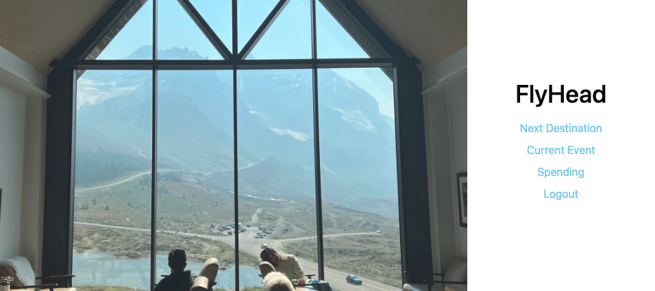
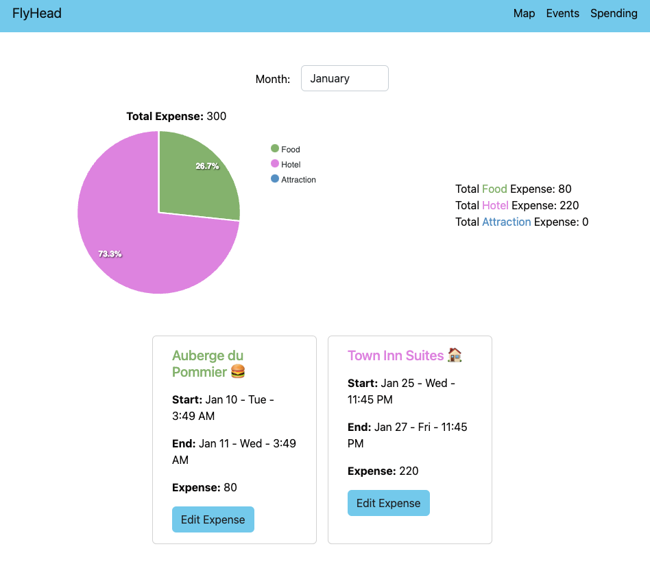

# FlyHead - Plan Your Next Trip

## Test credential

- email: test@gmail.com
- password:123456

## Landing Page

- User will need to Signup/Login to use this app.
- User are also provided with Google Oauth login option.

- After Login, user will see links to each pages.

## Map Page

- User can search locations from the top-right corner input filed.

- User can filter restaurants, hotels, attractions.

- User can also filter based on rating.

- By default, the map page will automatically load local restaurants near user location.

- User can checkout the details for each restaurants/hotels/attractions.

- User can acces the restaurants/hotels/attractions website by clicking button on the bottom, this will open a new tab for the user.

- User can add events to calendar by clicking 'Add Event' button on the bottom, a modal will prompt out for inputing the details of the event.

## Event Page

- All saved events will be showing on the Event Page.

- The detail of the events will be showing on the left and on the calendar.

- User can delete an event, also user can set the event to be a 'finished event'.

## Spending Page

- All finished events will be showing on the spending page.

- User can edit expense of each events.

- expense breakdown will automatically updated after the edit.
